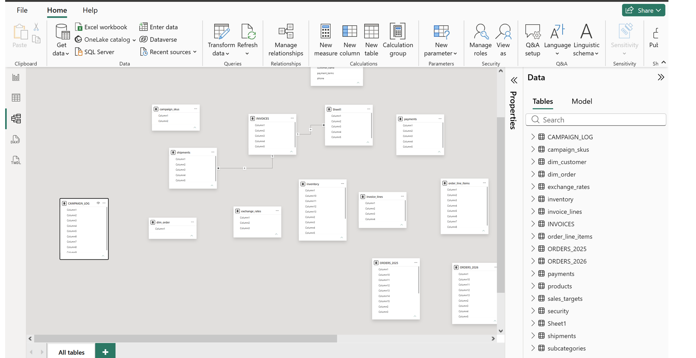
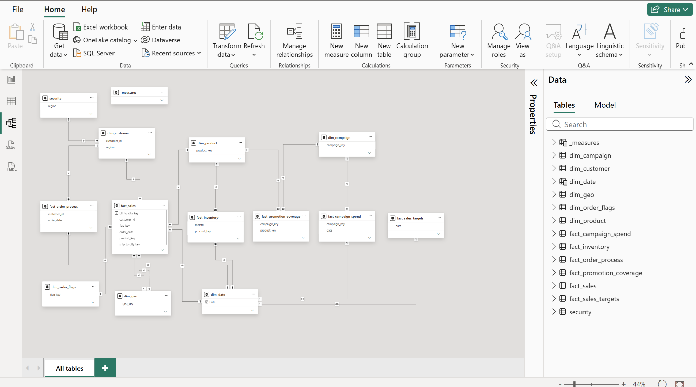

# Power BI Sales Data Model

An end-to-end Power BI data modeling project focused on transforming raw and initially unstructured data into a structured, secure, optimized, and maintainable analytical data model.

The project covers data exploration, data cleaning, standardization, dimensional modeling, fact table design, DAX, Date dimensions, Row-Level Security, model optimization, and reporting.

---

## Project Workflow

The project was developed through four major stages:

```text
Prepare & Explore
        ↓
Dimensions
        ↓
Facts
        ↓
Polish
```

The overall development process was:

```text
Understand the Business
        ↓
Understand the Data
        ↓
Identify the Grain
        ↓
Build Dimensions
        ↓
Build Facts
        ↓
Create Star Schema
        ↓
Add Date Dimension
        ↓
Create DAX Measures
        ↓
Apply Row-Level Security
        ↓
Standardize
        ↓
Optimize
        ↓
Build Reports
```

---

# 1. Prepare & Explore

The first step was understanding the existing data and business structure before making changes to the model.

The focus was on:

- Understanding the available tables
- Understanding the business process
- Identifying potential dimensions
- Identifying transactional data
- Identifying fact and dimension candidates
- Understanding relationships between tables
- Understanding the grain of the data
- Identifying areas of the existing model that needed restructuring

### Business and Data Understanding

Before building the model, the source data was explored to understand what each table represented and how the tables related to the business process.

A key principle followed throughout the project was:

> Understand the data before changing the model.

---

# 2. Dimensions

After understanding the source data, the next step was to identify and build the dimension tables.

The goal was to create clean dimensions that represent individual business entities.

Examples include:

- Customer
- Product
- Date
- Geography
- Order-related dimensions

### Dimension Modeling

The dimensions were designed around business entities rather than simply keeping the source tables as they were.

The process included:

- Grouping related attributes into dimensions
- Reshaping source tables
- Removing unnecessary fields
- Standardizing column names
- Cleaning inconsistent values
- Creating appropriate keys
- Preparing dimensions for relationships with fact tables

The general idea was:

```text
One business entity
        ↓
One clean dimension
        ↓
Reusable attributes for analysis
```

---

# 3. Facts

After the dimensions were established, the next step was designing the fact tables.

Fact tables represent measurable business events or processes.

The main sales fact table in this project is:

```text
fact_sales
```

Important fields include:

- Order ID
- Order Date
- Product Key
- Customer Key
- Quantity
- Discount
- Line Total
- Location Keys

## Fact Table Grain

One of the most important decisions in fact table design is defining the **grain**.

The grain answers:

> What does one row in this fact table represent?

For the sales fact table, the grain is based on the individual sales line/order-line level.

This means measures such as:

- Quantity
- Discount
- Line Total

can be analyzed at the appropriate transactional level.

Understanding the grain prevents incorrect aggregations and helps determine which dimensions can correctly relate to the fact table.

## Star Schema

The fact table was connected to the surrounding dimensions using a star-schema-oriented design.

```text
                    dim_date
                       |
                       |
dim_customer ---- fact_sales ---- dim_product
                       |
                       |
                  dim_location
```

The basic principle is:

```text
Dimensions
    ↓
provide context
    ↓
Fact
    ↓
provides measurable events
```

This structure makes filtering, aggregation, DAX calculations, and reporting easier to manage.

---

# 4. Factless Fact Tables

The project also explored the concept of a **factless fact table**.

A factless fact does not necessarily contain traditional numeric measures such as sales amount or quantity.

Instead, the rows themselves represent the occurrence of an event or relationship.

For example:

```text
campaign_key
product_key
store_key
channel_key
start_date
end_date
```

The existence of a row itself can represent an event or association.

This type of fact table can be useful when the business question is about:

- Whether something happened
- Participation
- Coverage
- Eligibility
- Relationships between entities
- Events without a numeric measurement

---

# 5. Accumulating Snapshot Fact

The project also covered the concept of an **accumulating snapshot fact table**.

Unlike a normal transaction fact, an accumulating snapshot tracks the progress of a business process through multiple stages.

For example, an order fulfillment process may contain:

```text
Order
  ↓
Packed
  ↓
Shipped
  ↓
Delivered
  ↓
Returned
```

The fact table can maintain milestone dates for these stages.

Example:

```text
order_key
customer_key
order_date
packed_date
shipped_date
delivered_date
returned_date
amount
quantity
```

This allows analysis of process duration and operational performance.

---

# 6. Polish

Once the main fact and dimension structures were created, the model was polished and validated.

This stage focused on making the model consistent, secure, readable, and maintainable.

The polishing stage included:

- Rechecking the data model
- Applying naming standards
- Adding the Date dimension
- Creating DAX measures
- Adding Row-Level Security
- Validating relationships
- Checking calculations
- Reviewing model consistency
- Optimizing the model

---

# 7. Modeling Standards

Standardization was applied throughout the model to make it easier to understand and maintain.

The model followed consistent conventions for:

- Table names
- Column names
- Keys
- Data types
- Relationships
- Measures
- Date fields

For example:

```text
fact_sales
dim_customer
dim_product
dim_date
```

Using consistent naming makes it easier to understand the model without having to inspect every field individually.

---

# 8. Data Cleaning

Power Query was used to clean and prepare the source data before loading it into the model.

The cleaning process included:

- Correcting data types
- Removing unnecessary columns
- Handling missing values
- Cleaning inconsistent values
- Renaming columns
- Preparing date fields
- Removing unwanted records
- Standardizing source values

The objective was to make the source data reliable before it reached the modeling layer.

---

# 9. Data Standardization

Standardization was applied to create consistency throughout the model.

Examples include:

- Consistent table naming
- Consistent column naming
- Consistent data types
- Standardized categorical values
- Standardized date formats
- Consistent key structures
- Consistent business rules

The principle followed was:

> Every column should have a clear purpose and a consistent standard.

---

# 10. Date Dimension

A dedicated Date dimension was created for time-based analysis.

The Date table contains attributes such as:

```text
Date
Year
Quarter
Month
Month Number
```

The Date dimension is connected to the sales fact table through the order date.

```text
dim_date[Date]
      1
      |
      |
      *
fact_sales[order_date]
```

This allows sales to be analyzed by:

- Year
- Quarter
- Month
- Day

The filtering flow can be represented as:

```text
Date[Month]
     ↓
Date[Date]
     ↓
fact_sales[order_date]
     ↓
fact_sales[line_total]
     ↓
Total Sales
```

This demonstrates how filters from the Date dimension propagate to the fact table before the sales measure is calculated.

---

# 11. DAX

DAX was used to create reusable business calculations and analytical measures.

### Total Sales

```DAX
Total Sales =
SUM(fact_sales[line_total])
```

Other analytical measures can be created for:

- Total Quantity
- Order Count
- Average Sales
- Discounts
- Time-based calculations
- KPIs

The purpose of using measures is to allow calculations to respond dynamically to the filter context of the report.

---

# 12. Row-Level Security

Row-Level Security (RLS) was implemented to restrict data based on the logged-in user's security mapping.

A dynamic security rule was created using the logged-in user's identity:

```DAX
[Region] =
LOOKUPVALUE(
    security[Region],
    security[UserEmail],
    USERPRINCIPALNAME()
)
```

The logic is:

```text
Logged-in User
      ↓
USERPRINCIPALNAME()
      ↓
Find matching email
      ↓
Find user's region
      ↓
Filter the model
```

This allows the same Power BI report to display different data depending on the user's assigned security information.

---

# 13. Model Optimization

The model was reviewed and optimized after the main modeling work was completed.

Optimization focused on:

- Removing unnecessary columns
- Reducing redundant data
- Using appropriate data types
- Structuring fact and dimension tables correctly
- Using appropriate relationships
- Controlling relationship filter directions
- Avoiding unnecessary calculated columns
- Using reusable DAX measures
- Reducing unnecessary model complexity

The goal was to create a model that is:

- Easier to understand
- Easier to maintain
- More efficient
- More scalable

---

# 14. Before vs After Data Modeling

One of the main improvements in the project was restructuring the original model into a cleaner analytical model.

### Before Data Modeling

The original model was more cluttered and difficult to understand.



### After Data Modeling

After applying dimensional modeling principles, the model became more structured and easier to understand.



The transformation focused on:

```text
Messy Source Model
        ↓
Understand Business Process
        ↓
Identify Dimensions
        ↓
Define Fact Grain
        ↓
Build Star Schema
        ↓
Standardize
        ↓
Secure
        ↓
Optimize
```

---

# 15. Sales Analysis

The final model supports analysis across multiple business dimensions.

Examples include:

- Monthly Sales
- Yearly Sales
- Product Performance
- Customer Performance
- Regional Sales
- Quantity Analysis
- Discount Analysis
- Order Analysis

Example:

| Month | Total Sales |
|---|---:|
| January | ₹51,000 |
| February | ₹17,000 |
| March | ₹56,200 |

---

# 16. Power BI Report

The final model can be used to create interactive reports and dashboards.

The report can be explored using:

- Filters
- Slicers
- Date selections
- Product dimensions
- Customer dimensions
- Regional dimensions
- Sales measures

---

# 17. Key Concepts Demonstrated

This project demonstrates practical experience with:

- Power BI Desktop
- Power Query
- Data Cleaning
- Data Transformation
- Data Standardization
- Dimensional Modeling
- Star Schema
- Fact Tables
- Dimension Tables
- Factless Fact Tables
- Accumulating Snapshot Facts
- Fact Table Grain
- Relationships
- Filter Propagation
- Filter Context
- DAX
- Date Dimensions
- Row-Level Security
- Model Optimization
- Interactive Reporting

---

# 18. Project Architecture

The overall project can be summarized as:

```text
                         SOURCE DATA
                              |
                              ↓
                      DATA PREPARATION
                              |
                     ┌─────────┴─────────┐
                     ↓                   ↓
                DIMENSIONS            FACTS
                     ↓                   ↓
                     └─────────┬─────────┘
                               ↓
                         STAR SCHEMA
                               ↓
                        DATE DIMENSION
                               ↓
                         DAX MEASURES
                               ↓
                      ROW-LEVEL SECURITY
                               ↓
                       MODEL OPTIMIZATION
                               ↓
                     POWER BI REPORTING
```

---

# 19. Project Structure

```text
powerbi-sales-data-model/
│
├── README.md
│
├── data/
│   └── source-data/
│
├── powerbi/
│   └── sales-data-model.pbix
│
└── screenshots/
    ├── model-before.png
    └── model-after.png
```

---

# 20. Key Learning

The main learning from this project was that Power BI development is not only about creating charts and dashboards.

A reliable analytical solution starts with understanding the data and designing the model correctly.

The overall approach was:

```text
Understand the Business
        ↓
Understand the Data
        ↓
Identify the Grain
        ↓
Build Dimensions
        ↓
Build Facts
        ↓
Create Star Schema
        ↓
Add Date Dimension
        ↓
Create DAX Measures
        ↓
Apply Security
        ↓
Standardize
        ↓
Optimize
        ↓
Build Reports
```

This project helped build a practical understanding of how the underlying data model controls:

- Filtering
- Aggregation
- Relationships
- DAX calculations
- Security
- Reporting behavior
- Model maintainability

---

# Author

**Uday Kumar**

B.Tech Computer Science Engineering
